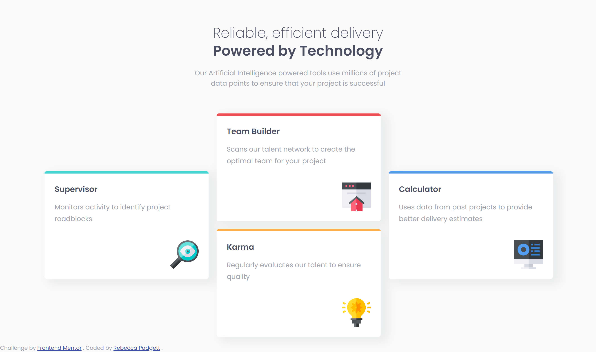

# Frontend Mentor - Four card feature section solution

This is a solution to the [Four card feature section challenge on Frontend Mentor](https://www.frontendmentor.io/challenges/four-card-feature-section-weK1eFYK). Frontend Mentor challenges help you improve your coding skills by building realistic projects.

## Table of contents

- [Overview](#overview)
  - [The challenge](#the-challenge)
  - [Screenshot](#screenshot)
  - [Links](#links)
- [My process](#my-process)
  - [Built with](#built-with)
  - [What I learned](#what-i-learned)
  - [Continued development](#continued-development)
- [Author](#author)

## Overview

### The challenge

Users should be able to:

- View the optimal layout for the site depending on their device's screen size

### Screenshot



### Links

- Solution URL: [Frontend Mentor](https://www.frontendmentor.io/solutions/four-card-feature-section-using-css-grid-DpXQaukrKa)
- Live Site URL: [Github Pages](https://bccpadge.github.io/four-card-feature-section/)

## My process

### Built with

- Semantic HTML5 markup
- CSS custom properties
- Flexbox
- CSS Grid
- Mobile-first workflow

### What I learned

When building this project, I used CSS Grid to add space between the card title and description.

```css
.grid-sm {
  display: grid;
  gap: 1rem;
}
```

### Continued development

I want to focus on modern CSS techinques in future projects. The clamp() function is concept that I am uncomfortable at moment and hopefully with practice I get better using it.

## Author

- Frontend Mentor - [@bccpadge](https://www.frontendmentor.io/profile/bccpadge)
- Github - [@bccpadge](https://github.com/bccpadge)
